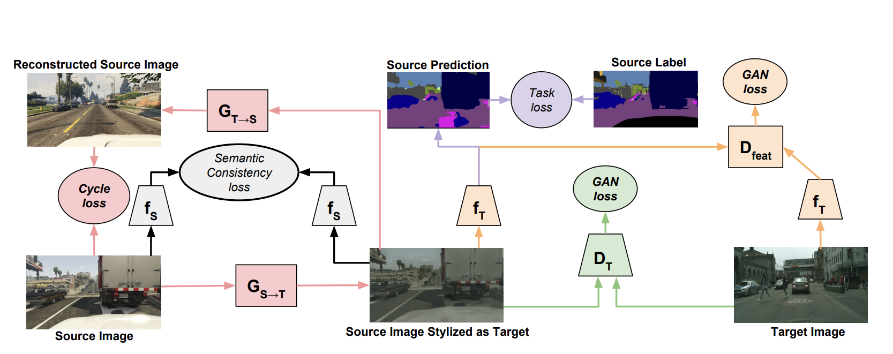

## 10-Week Syllabus

#### 1 : How to Make a Dog From Noise

Introduction to Generative Models & Building Your First GAN 
- Introduction to Generative Models vs. Discriminative Models, and where GANs are situated in this context
- Intuition Behind GANs
    - Role of the discriminator
    - Role of the generator
    - BCE loss
    - Training vs. Inference
- Deep Convolutional GANs
- Review of Pytorch, convolutions, activation functions, batch normalization, padding & striding, pooling & upsampling, transposed convolutions
- Mode Collapse and Problems with BCE Loss
- Earth Mover’s Distance (Wasserstein Distance)
- Wasserstein-Loss
- Condition on W-loss Critic
- 1-Lipschitz Continuity Enforcement

#### 2 : How to Make a Specific Shoe

Controllable Generation and Conditional GAN  [Problem set 1 due]
- Conditional Generation: Intuition & Inputs 
- Controllable Generation and how it is situated vis-a-vis Conditional Generation
- Vector Algebra in Latent Space
- Challenges with Controllable Generation 
- Using Classifier Gradients for Controllable Generation
- Supervised disentanglement 
- Evaluation: Inception Score, Frechet Inception Distance, HYPE, classifier-based evaluation of Disentanglement
- Challenges in Generative Model evaluation, particularly GANs, Importance of Evaluation
- Fidelity vs. Diversity Tradeoffs, Truncation Trick Sampling
- Inception Embeddings vs. Pixel Comparisons 
- Inception Score: Intuition, Shortcomings
- Frechet Inception Distance: Intuition, Shortcomings
- Gold Standard in Fidelity (human-centered approach)
- Intuition of Precision vs. Recall in Generative Models
- Evaluating Disentanglement using the Classifier Method, Perceptual Path Length

#### 3 : Making High Quality Faces (and Other Complex Things)

Advancements in GANs and State of the Art Improvements for StyleGAN, Fine-tuning GANs [Problem set 2 due]
- Components of StyleGAN: 
    - Disentangled Intermediate Latent W-Space
    - Noise Injection at Multiple Layers (Increased Style Supervision)
    - Uncorrelated Noise for Stochasticity
    - Adaptive Instance Normalization
    - Progressive Growing
- StyleGAN2
- Fine-tuning Large GANs, Pros/Cons

#### 4 : Changing Painters, Species, and Seasons

Image-to-Image Translation [Problem set 3 due] [Final Project check-in halfway through this week]
- Pix2Pix for Paired Image-to-Image Translation
    - U-Net, Skip Connections
    - PatchGAN
- CycleGAN for Unpaired Image-to-Image Translation
    - Cycle Consistency
    - Identity Loss
- Multimodal Generation:
    - Shared Latent Space Assumption (UNIT)
    - Extended to Multimodal (MUNIT)
- Beyond Image-to-Image: Other Translation Forms
    - GauGAN: Instance Segmentation to Images
    - Text-to-Image, Image-to-Text
    - Musical-Notes-to-Melody
- Image Editing, In-painting, and GAN Inversion
- Image Editing, Photoshop 2.0
- Inverting a GAN, Challenges from Increasing Model Size, BiGAN
- GAN Inversion vs. Image Optimization
- Combining Inversion Techniques (“Warm Start”) with Optimization

#### 5 : Reading More Papers

Reading papers in GANs  [Problem set 4 due] [Final Project due]
- Approach to Reading Research Papers: Skim Twice, Read Twice
- Model Diagrams and Common Representations
- Adjacent Areas of Research: adversarial learning, robustness/adversarial attacks
- Compelling applied areas and research:
    - Healthcare
    - Climate change

#### 6-10: Projects